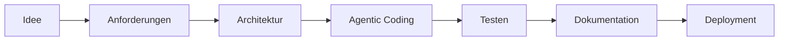

<div align="center">

# Hallo, ich bin Philipp 👋

### AI · Full-Stack · Backend · Agentic Coding

Ich entwickle KI-gestützte Anwendungen, Webservices und Automatisierungen –
von der ersten Idee über die Architektur bis zur funktionierenden Anwendung.

📍 Hamburg, Deutschland

</div>

---

## Über mich

Mein Schwerpunkt liegt auf der Verbindung von **moderner KI mit klassischer Softwareentwicklung**.

Aktuell entwickle ich unter anderem:

* autonome Recherche- und KI-Agenten
* Full-Stack-Webanwendungen
* Python-Backends und APIs
* Finanz- und Datenanwendungen
* Automatisierungen mit LLMs
* FiveM-Ressourcen und Backend-Systeme

Dabei arbeite ich intensiv mit Coding-Agenten wie **OpenAI Codex, Claude Code und Cursor**. GitHub nutze ich, um meine Projekte, Lernfortschritte und wachsende Erfahrung in der Softwareentwicklung zu dokumentieren.

---

## Aktueller Fokus

```text
AI Agents       ███████████████████░
Full-Stack      █████████████████░░░
Backend         ████████████████░░░░
Automation      ███████████████░░░░░
FiveM / Lua     ████████████░░░░░░░░
```

* Entwicklung zuverlässiger LLM-Agenten
* Agentic Coding und autonome Entwicklungsworkflows
* Full-Stack-Anwendungen mit Next.js und TypeScript
* APIs, Datenbanken und Backend-Architekturen
* strukturierte Ausgaben und Tool Calling
* saubere, wartbare Projektstrukturen

---

## Ausgewählte Projekte

<table>
<tr>
<td width="50%" valign="top">

### 💶 Finanz-App

Eine moderne Full-Stack-Anwendung zur Verwaltung und übersichtlichen Darstellung persönlicher Finanzen.

**Schwerpunkte**

* Finanz-Dashboard
* Einnahmen und Ausgaben
* moderne Benutzeroberfläche
* persistente Datenspeicherung
* strukturierte Full-Stack-Architektur

**Technologien**

`Next.js` `TypeScript` `Prisma` `React`

[Repository öffnen →](https://github.com/PhilippBecksmann/Finanz-App)

</td>
<td width="50%" valign="top">

### 🔎 Deep Research Agent

Ein KI-Agent, der Themen selbstständig zerlegt, aktuelle Quellen recherchiert, Webseiten vollständig ausliest und daraus einen strukturierten Bericht erstellt.

**Schwerpunkte**

* mehrstufige Rechercheplanung
* Live-Suche mit DuckDuckGo
* Deep Reading von Webseiten
* LLM-gestützte Zusammenfassungen
* Berichte mit Quellenangaben

**Technologien**

`Python` `Pydantic AI` `Gradio` `OpenAI` `DuckDuckGo` `httpx`

[Repository öffnen →](https://github.com/PhilippBecksmann/Deep-Research)

</td>
</tr>

<tr>
<td width="50%" valign="top">

### 🤖 Python AI Chatbot

Ein modularer KI-Chatbot mit Agentenlogik, validierten Ausgaben und einer benutzerfreundlichen Chatoberfläche.

**Schwerpunkte**

* OpenAI-Modellanbindung
* Pydantic-AI-Agent
* strukturierte Ausgaben
* Gradio-Frontend
* sichere Konfiguration mit Umgebungsvariablen

**Technologien**

`Python` `Pydantic AI` `Gradio` `OpenAI API`

[Repository öffnen →](https://github.com/PhilippBecksmann/Python-Bot-mit-Gradio-Pydantic)

</td>
<td width="50%" valign="top">

### 🎮 Unwritten RP

Ein FiveM- und GTA-V-Roleplay-Projekt mit eigener Verwaltungsoberfläche und Backend-Infrastruktur.

**Schwerpunkte**

* Administrationsoberfläche
* Spieler- und Jobverwaltung
* REST-Backend
* Authentifizierung
* Datenbankanbindung
* eigene FiveM-Ressourcen

**Technologien**

`Node.js` `Express` `MySQL` `Lua` `JavaScript` `Linux`

[Repository öffnen →](https://github.com/PhilippBecksmann/UnwrittenRP_Portfolio)

</td>
</tr>
</table>

---

## Technologien

### Sprachen

<p>
  
</p>

### Frontend und Backend

<p>
  
</p>

### Datenbanken und Infrastruktur

<p>
  
</p>

### KI und Entwicklungswerkzeuge

<p>
  
</p>

`Pydantic AI` · `Gradio` · `OpenAI API` · `LLM Tool Calling` · `Cursor` · `Claude Code` · `OpenAI Codex`

---

## Wie ich entwickle



Ich nutze KI nicht nur zur Codegenerierung, sondern als Bestandteil eines strukturierten Entwicklungsprozesses:

1. Anforderungen und Ziele definieren
2. Architektur und Datenmodelle planen
3. Coding-Agenten mit klaren Regeln steuern
4. Ergebnisse prüfen, testen und verbessern
5. Projekte dokumentieren und veröffentlichen

---

## Derzeit lerne und vertiefe ich

* professionelle Python- und TypeScript-Entwicklung
* Next.js und moderne React-Anwendungen
* Pydantic AI und Multi-Agent-Systeme
* Tool Calling und strukturierte LLM-Ausgaben
* API-Design und Backend-Architektur
* Datenmodellierung mit Prisma und SQL
* Testing und Fehlerbehandlung
* Docker, Deployment und CI/CD
* Agentic Coding mit Codex, Claude Code und Cursor

---

## Roadmap

* [x] erste JavaScript-Anwendungen entwickeln
* [x] eigenes FiveM-Backend umsetzen
* [x] KI-Chatbot mit Pydantic AI entwickeln
* [x] Deep-Research-Agent mit Websuche erstellen
* [x] Full-Stack-Finanzanwendung starten
* [ ] automatisierte Tests und CI/CD integrieren
* [ ] Anwendungen mit Docker bereitstellen
* [ ] produktionsreife KI-Webservices entwickeln
* [ ] komplexere Multi-Agent-Workflows umsetzen
* [ ] eigenes SaaS-Produkt veröffentlichen

---

## Entwicklungsprinzipien

> Nicht nur Code erzeugen lassen, sondern verstehen, strukturieren, prüfen und kontinuierlich verbessern.

Mir sind besonders wichtig:

* nachvollziehbare Architektur
* verständlicher und wartbarer Code
* sinnvolle Dokumentation
* sichere Konfiguration
* praxisnahe Projekte
* kontinuierliches Lernen

---

## Kontakt

<p>
  <a href="https://github.com/PhilippBecksmann">
    
  </a>
</p>

---

<div align="center">

### Vom Lernprojekt zur produktionsreifen Anwendung.

**Building practical software with AI, one project at a time.**

</div>
